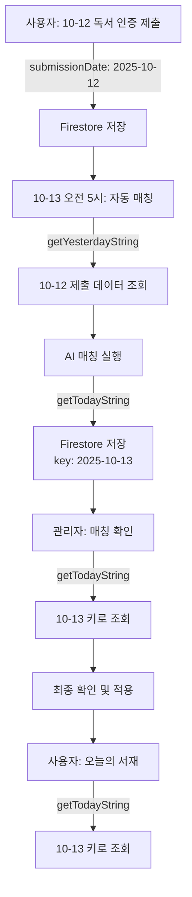

# 📅 날짜 로직 설계 문서 (Date Logic Design)

**최종 업데이트**: 2025-10-13
**문서 버전**: v1.0.0
**카테고리**: Architecture

---

## 🎯 개요

필립앤소피 프로젝트의 날짜 처리 로직은 **3가지 서로 다른 날짜 개념**을 사용합니다. 이 문서는 각 날짜의 용도와 사용 규칙을 명확히 정의하여 날짜 관련 버그를 방지합니다.

---

## 📚 핵심 개념

### 1. 제출 날짜 (Submission Date)

**정의**: 사용자가 독서 인증을 제출한 날짜

**사용처**:
- Firestore `reading_submissions.submissionDate` 필드
- 제출물 필터링 쿼리

**함수**: `getYesterdayString()` (매칭 시스템에서)

**예시**:
```typescript
// 매칭 시: 어제 제출된 데이터를 조회
const submissionDate = getYesterdayString(); // "2025-10-12"
const submissions = await db.collection('reading_submissions')
  .where('submissionDate', '==', submissionDate)
  .get();
```

---

### 2. 매칭 키 (Matching Key)

**정의**: Firestore에 매칭 결과를 저장/조회할 때 사용하는 날짜 키

**사용처**:
- Firestore `cohorts.dailyFeaturedParticipants[date]` 키
- 사용자가 "오늘의 서재"에서 확인하는 날짜

**함수**: `getTodayString()` (항상)

**예시**:
```typescript
// 저장 시
const matchingKey = getTodayString(); // "2025-10-13"
dailyFeaturedParticipants[matchingKey] = matching;

// 조회 시
const matchingKey = getTodayString(); // "2025-10-13"
const matching = dailyFeaturedParticipants[matchingKey];
```

---

### 3. 질문 날짜 (Question Date)

**정의**: 독서 인증 시 답변한 "오늘의 질문"의 날짜

**사용처**:
- Daily Question 텍스트 조회
- UI 표시용

**함수**: `getDailyQuestionText(date)`

**예시**:
```typescript
// 어제 질문을 기준으로 매칭
const yesterdayQuestion = getDailyQuestionText(getYesterdayString());

// 오늘 질문을 UI에 표시
const todayQuestion = getDailyQuestionText(getTodayString());
```

---

## 🔄 매칭 시스템 플로우

### 시나리오: 2025-10-13 오전 10시 (KST)

| 단계 | 액션 | 날짜 | 함수 | 용도 |
|------|------|------|------|------|
| **1단계** | 어제(10-12) 독서 인증 제출 | `2025-10-12` | 사용자 제출 | `submissionDate` 필드 |
| **2단계** | 오전 5시 자동 매칭 실행 | `2025-10-12` | `getYesterdayString()` | 제출물 필터링 |
| **3단계** | 매칭 결과 Firestore 저장 | `2025-10-13` | `getTodayString()` | 매칭 키 |
| **4단계** | 관리자 페이지 조회 | `2025-10-13` | `getTodayString()` | 매칭 키 |
| **5단계** | 사용자 "오늘의 서재" 조회 | `2025-10-13` | `getTodayString()` | 매칭 키 |

---

## 🚨 중요 규칙

### ✅ DO (반드시 따라야 할 것)

1. **매칭 결과 저장**: 항상 `getTodayString()` 키 사용
   ```typescript
   const matchingKey = getTodayString();
   dailyFeaturedParticipants[matchingKey] = matching;
   ```

2. **매칭 결과 조회**: 항상 `getTodayString()` 키 사용
   ```typescript
   const matchingKey = getTodayString();
   const response = await fetch(`/api/admin/matching?date=${matchingKey}`);
   ```

3. **제출물 필터링**: `getYesterdayString()` 사용 (어제 제출 데이터)
   ```typescript
   const submissionDate = getYesterdayString();
   const submissions = await db.collection('reading_submissions')
     .where('submissionDate', '==', submissionDate)
     .get();
   ```

4. **일관성 유지**: 저장과 조회에 **같은 날짜 키** 사용
   ```typescript
   // ✅ 올바른 예
   const key = getTodayString();
   save(key, data); // 저장
   load(key);        // 조회

   // ❌ 잘못된 예
   save(getTodayString(), data);    // 오늘로 저장
   load(getYesterdayString());      // 어제로 조회 (못 찾음!)
   ```

---

### ❌ DON'T (절대 하지 말 것)

1. **저장과 조회에 다른 날짜 사용**
   ```typescript
   // ❌ 버그 발생!
   const saveKey = getTodayString();     // "2025-10-13"
   const loadKey = getYesterdayString(); // "2025-10-12"
   dailyFeaturedParticipants[saveKey] = matching; // 저장
   const result = dailyFeaturedParticipants[loadKey]; // undefined!
   ```

2. **매칭 키로 `getYesterdayString()` 사용**
   ```typescript
   // ❌ 잘못된 예
   const matchingKey = getYesterdayString(); // 매칭 키는 항상 오늘!
   ```

3. **하드코딩된 날짜 사용**
   ```typescript
   // ❌ 절대 금지!
   const date = "2025-10-13"; // 타임존 문제 발생

   // ✅ 올바른 방법
   const date = getTodayString(); // KST 자동 처리
   ```

---

## 🛠️ 핵심 함수 레퍼런스

### `getTodayString(): string`

**용도**: 한국 시간(KST) 기준 오늘 날짜

**반환**: `"YYYY-MM-DD"` (예: `"2025-10-13"`)

**주의사항**:
- Vercel 서버는 UTC 사용
- 명시적으로 KST 변환 필요
- 매칭 키로 사용할 때 항상 이 함수 사용

```typescript
import { getTodayString } from '@/lib/date-utils';

const today = getTodayString(); // "2025-10-13" (KST)
```

---

### `getYesterdayString(): string`

**용도**: 한국 시간(KST) 기준 어제 날짜

**반환**: `"YYYY-MM-DD"` (예: `"2025-10-12"`)

**주의사항**:
- 제출물 필터링 전용
- 매칭 키로 사용 금지!

```typescript
import { getYesterdayString } from '@/lib/date-utils';

const yesterday = getYesterdayString(); // "2025-10-12" (KST)
```

---

### `getDailyQuestionText(date: string): string`

**용도**: 특정 날짜의 "오늘의 질문" 텍스트 조회

**파라미터**: `date` - `"YYYY-MM-DD"` 형식

**반환**: 질문 텍스트 (예: `"오늘 하루 당신을 행복하게 한 것은?"`)

```typescript
import { getDailyQuestionText } from '@/constants/daily-questions';

const question = getDailyQuestionText("2025-10-13");
```

---

## 📝 API 별 날짜 사용 규칙

### Preview API (`/api/admin/matching/preview`)

**목적**: AI 매칭 프리뷰 생성 (저장 안 함)

**날짜 사용**:
- 제출물 조회: `getYesterdayString()` (어제 데이터)
- 반환 값: `getTodayString()` (오늘 날짜로 표시)

```typescript
// src/app/api/admin/matching/preview/route.ts
const submissionDate = getYesterdayString(); // "2025-10-12"
const submissions = await db.collection('reading_submissions')
  .where('submissionDate', '==', submissionDate)
  .get();

return NextResponse.json({
  date: getTodayString(), // "2025-10-13" (사용자에게 오늘 날짜로 표시)
  matching: result,
});
```

---

### Confirm API (`/api/admin/matching/confirm`)

**목적**: 매칭 결과 최종 확인 및 저장

**날짜 사용**:
- 저장 키: `date` 파라미터 또는 `getTodayString()` (기본값)
- **중요**: 항상 오늘 날짜로 저장!

```typescript
// src/app/api/admin/matching/confirm/route.ts
const { cohortId, matching, date } = await request.json();
const matchingKey = date || getTodayString(); // "2025-10-13"

dailyFeaturedParticipants[matchingKey] = matching;
```

---

### GET API (`/api/admin/matching`)

**목적**: 특정 날짜의 매칭 결과 조회

**날짜 사용**:
- 조회 키: `date` 쿼리 파라미터 또는 `getTodayString()` (기본값)
- **중요**: 저장할 때 사용한 날짜와 동일해야 함!

```typescript
// src/app/api/admin/matching/route.ts (GET)
const date = searchParams.get('date') || getTodayString(); // "2025-10-13"
const matching = dailyFeaturedParticipants[date];
```

---

### Scheduled Function (Firebase)

**목적**: 매일 오전 5시 자동 매칭

**날짜 사용**:
- Preview API 호출: `cohortId`만 전달 (자동으로 어제 데이터 조회)
- Firestore 저장 키: `previewResult.date` (오늘 날짜)

```typescript
// functions/src/index.ts
const response = await fetch(`${apiBaseUrl}/api/admin/matching/preview`, {
  method: "POST",
  body: JSON.stringify({ cohortId }),
});

const previewData = {
  date: previewResult.date, // getTodayString() 값 (오늘)
  matching: previewResult.matching,
};

const previewRef = db.collection('matching_previews')
  .doc(`${cohortId}-${previewResult.date}`); // 오늘 날짜 키
```

---

## 🐛 트러블슈팅

### 문제: 모바일에서 매칭 결과가 안 보임

**증상**:
- 데스크탑: 정상 표시
- 모바일/PWA: "아직 매칭 결과가 없습니다" 표시

**원인**:
```typescript
// ❌ 잘못된 코드
const response = await fetch(
  `/api/admin/matching?date=${submissionDate}` // 어제 날짜로 조회
);

// 하지만 저장은 오늘 날짜로 했음
dailyFeaturedParticipants[todayDate] = matching;
```

**해결**:
```typescript
// ✅ 올바른 코드
const matchingKey = getTodayString(); // 저장과 조회에 같은 키 사용
const response = await fetch(
  `/api/admin/matching?date=${matchingKey}`
);
```

---

### 문제: 스케줄러가 어제 데이터를 못 찾음

**증상**:
- 오전 5시 자동 매칭 실행 시 "참가자가 없습니다" 에러

**원인**:
```typescript
// ❌ 잘못된 쿼리
const today = getTodayString(); // "2025-10-13"
const submissions = await db.collection('reading_submissions')
  .where('submissionDate', '==', today) // 오늘 제출은 아직 없음!
  .get();
```

**해결**:
```typescript
// ✅ 올바른 쿼리
const yesterday = getYesterdayString(); // "2025-10-12"
const submissions = await db.collection('reading_submissions')
  .where('submissionDate', '==', yesterday) // 어제 제출 데이터
  .get();
```

---

## 📊 날짜 흐름도



---

## ✅ 체크리스트

새로운 날짜 관련 코드를 작성할 때:

- [ ] 매칭 결과 저장 시 `getTodayString()` 사용?
- [ ] 매칭 결과 조회 시 `getTodayString()` 사용?
- [ ] 제출물 필터링 시 `getYesterdayString()` 사용?
- [ ] 저장과 조회에 **같은 날짜 키** 사용?
- [ ] 하드코딩된 날짜 없음?
- [ ] KST 타임존 고려됨?

---

## 🔗 관련 문서

- [TRD - 기술 요구사항](./trd.md)
- [성능 최적화 가이드](../optimization/performance.md)
- [데이터베이스 최적화](../optimization/database.md)

---

**마지막 업데이트**: 2025-10-13
**작성자**: Development Team
**버전**: v1.0.0
**위치**: `docs/architecture/date-logic.md`
